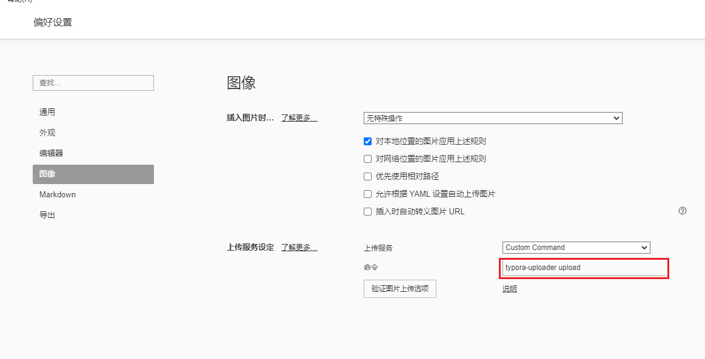

# typora-uploader

free image uploader, not only used in `typora`


## How to Use

```javascript

npm i typora-uploader -g

typora-uploader -h

typora-uploader upload path/to/iamge1.jpg path/to/image2.jpg

```


## Typora Settings




## TODO

- 网络图片间接上传
- 百度图床支持
- 参数开放
- 参数设置持久化
- 不支持的图片格式进行本地先转码再上传
